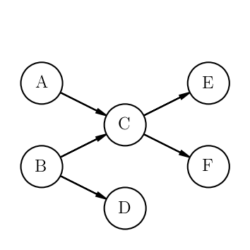

.. _examples:

Examples
========

Your First Project
------------------
The simplest way to construct a project is to use deterministic distributions for the duration, earliest start date, and
latest start date. Suppose our project has 6 tasks -- A, B, C, D, E, F specified as

+------+-----------+---------------------+--------------------+
| Task | Duration  | Earliest start date | Latest finish date |
+======+===========+=====================+====================+
| A    | 1 day     | Anytime             | --                 |
+------+-----------+---------------------+--------------------+
| B    | 3.5 hours | 2018-05-14 12pm     | --                 |
+------+-----------+---------------------+--------------------+
| C    | 2 days    | --                  | --                 |
+------+-----------+---------------------+--------------------+
| D    | 3 days    | --                  | 2018-04-16         |
+------+-----------+---------------------+--------------------+
| E    | 1 hour    | --                  | 2018-05-15         |
+------+-----------+---------------------+--------------------+
| F    | 5 hours   | --                  | 2018-05-20         |
+------+-----------+---------------------+--------------------+

With the following dependencies

We first write create Tasks from DurationPdfs for the durations and DatePdfs for the earliest start and latest finish
dates

.. code-block:: python
   :linenos:

   from datetime import datetime

   from projectpredict import Project, Task, TimeUnits, DurationPdf, DatePdf
   from projectpredict.pdf import DeterministicPdf

   taskB_earliest_start_date = datetime(year=2018, month=5, day=14, hour=12)

   # We make a DatePdf centered around taskB_earliest_start_date.
   # The second parameter should be a zero-mean distribution.
   # Because this start date is fully deterministic, we use a DeterministicPdf
   # with value of 0
   taskB_earliest_start_pdf = DatePdf(taskB_earliest_start_date, DeterministicPdf(0))

   #

   # Because Task A doesn't specify an earliest start date pdf it is assumed that
   # it can begin any time.
   taskA = Task(
       'A',
       duration_pdf=DurationPdf(DeterministicPdf(1), units=TimeUnits.days)
   )

   taskB = Task(
       'B',
       duration_pdf=DurationPdf(DeterministicPdf(3.5), TimeUnits.hours),
       earliest_start_date_pdf=taskB_earliest_start_pdf
   )

   taskC = Task(
       'C',
       duration_pdf=DurationPdf(DeterministicPdf(2), units=TimeUnits.days)
   )

   # Final tasks require a latest finish date
   taskD_latest_finish_date = datetime(year=2018, month=5, day=16)
   taskE_latest_finish_date = datetime(year=2018, month=5, day=15)
   taskF_latest_finish_date = datetime(year=2018, month=5, day=20)

   taskD = Task(
       'D',
       duration_pdf=DurationPdf(DeterministicPdf(3), units=TimeUnits.days),
       latest_finish_date_pdf=DatePdf(taskD_latest_finish_date, DeterministicPdf(0))
   )

   taskE = Task(
       'E',
       duration_pdf=DurationPdf(DeterministicPdf(1), units=TimeUnits.hours),
       latest_finish_date_pdf=DatePdf(taskE_latest_finish_date, DeterministicPdf(0))
   )

   taskF = Task(
       'F',
       duration_pdf=DurationPdf(DeterministicPdf(5), units=TimeUnits.hours),
       latest_finish_date_pdf=DatePdf(taskF_latest_finish_date, DeterministicPdf(0))
   )

Once we have defined the tasks, we can add the tasks and their dependencies to the project.

.. code-block:: python
   :linenos:

   # Construct a Project with the name "MyProject"
   project = Project('MyProject')

   tasks = [taskA, taskB, taskC, taskD, taskE, taskF]
   dependencies = [
       (taskA, taskC),
       (taskB, taskC),
       (taskB, taskD),
       (taskC, taskE),
       (taskC, taskF)
   ]
   project.add_tasks(tasks)
   project.add_dependencies(dependencies)

Finally we can get the derived latest start date, earliest finish date, and total float for the tasks.

.. code-block:: python
   :linenos:

   # We can specify a current time. If not specified, then
   # The current wall time is used
   current_time = datetime(year=2018, month=5, day=12, hour=12)

   # Because all the distributions are deterministic, we only need 1 iteration
   stats = project.calculate_task_statistics(current_time=current_time, iterations=1)

   taskA_stats = stats[taskA]

   print('earliest finish: {}'.format(taskA_stats.earliest_finish))
   print('latest start: {}'.format(taskA_stats.latest_start))
   print('total float: {}'.format(taskA_stats.total_float))

.. code-block:: python
   :linenos:

   "earliest finish: {'variance': datetime.timedelta(0), 'mean': datetime.datetime(2018, 5, 13, 12, 0)}"
   "latest start: {'variance': datetime.timedelta(0), 'mean': datetime.datetime(2018, 5, 11, 23, 0)}"
   "total float: {'variance': datetime.timedelta(0), 'mean': datetime.timedelta(-1, 39600)}"

For this particular project, the total float is negative, indicating that Task A appears to already be past the deadline.
Additionally, we could use calculate_earliest_finish_times() and calculate_latest_start_times() methods to calculate only
the earliest finish dates and latest start dates respectively.

Using Distributions
-------------------
The world is almost never kind enough to let us know the exact duration of a task, and some deadlines are more flexible
than others, and some earliest start dates may be uncertain. Rather than blindly guessing a distribution for the
durations, we'll use `three-point (PERT) estimation <https://en.wikipedia.org/wiki/Three-point_estimation>`_ to derive
the distribution using the Task.from_pert() method.

+------+------------+-----------------------+
| Task |            Duration                |
|      +-----------+-----------+------------+
|      | Best Case | Expected  | Worst Case |
+======+===========+===========+============+
| A    | 5 hours   | 24 hours  | 36 hours   |
+------+-----------+-----------+------------+
| B    | 0.5 hours | 3.5 hours | 10 hours   |
+------+-----------+-----------+------------+
| C    | 1 day     | 2 days    | 4 days     |
+------+-----------+-----------+------------+
| D    | 0.5 days  | 3 days    | 7 days     |
+------+-----------+-----------+------------+
| E    | 0.2 hours | 1 hour    | 4 hours    |
+------+-----------+-----------+------------+
| F    | 1 hour    | 5 hours   | 10 hours   |
+------+-----------+-----------+------------+

We'll also put a zero-mean Gaussian distribution over the earliest start date of Task B and the latest finish date of
Task D.

.. code-block:: python
   :linenos:

   from projectpredict.pdf import GaussianPdf

   taskB_earliest_start_date = datetime(year=2018, month=5, day=14, hour=12)

   taskA = Task.from_pert('A', 5, 24, 36, units=TimeUnits.hours)

   taskB = Task.from_pert('B', 0.5, 3.5, 10, units=TimeUnits.hours,
       earliest_start_date_pdf=DatePdf(
           taskB_earliest_start_date,
           GaussianPdf(0, 2),
           units=TimeUnits.hours)
   )

   taskC = Task.from_pert('C', 1, 2, 4, units=TimeUnits.days)

   taskD_latest_finish_date = datetime(year=2018, month=5, day=16)
   taskE_latest_finish_date = datetime(year=2018, month=5, day=15)
   taskF_latest_finish_date = datetime(year=2018, month=5, day=20)

   taskD = Task.from_pert('D', 0.5, 3, 7, units=TimeUnits.days,
       latest_finish_date_pdf=DatePdf(
           taskD_latest_finish_date,
           GaussianPdf(0, 1),
           units=TimeUnits.days
       )
   )

   taskE = Task.from_pert('E', 0.2, 1, 4, units=TimeUnits.hours,
       latest_finish_date_pdf=DatePdf(taskE_latest_finish_date, DeterministicPdf(0))
   )

   taskF = Task.from_pert('F', 1, 5, 10, units=TimeUnits.hours,
       latest_finish_date_pdf=DatePdf(taskF_latest_finish_date, DeterministicPdf(0))
   )

From here, we can add the tasks and dependencies to a Project and calculate the statistics same as in the previous
example.

Learned Model
-------------
While using three-point estimation is much better than either deterministic or guessing a distribution, it would be even
better to learn the distribution from a model. Imagine you are using an issue tracker for a software project. Frequently
you'll have some knowledge of what team the work will be done by and the story points of the task. You may also have
some history of how long each task took to complete. Using this information, you could train a model to determine the
duration a task will take. ProjectPredict currently supports using a Gaussian Process Regression model from scikit-learn
to predict the duration of the task. We'll first generate some simulated data for the project. We'll assume the durations
are in units of days.

.. code-block:: python
   :linenos:

   import numpy as np
   from scipy.stats import norm
   import pandas as pd

   # We give out teams integer keys, a name, and a probability that any given
   # task will be assigned to them
   teams = {
       1: {'team': 'red', 'prob': 0.5},
       2: {'team': 'blue', 'prob': 0.25},
       3: {'team': 'green', 'prob': 0.15},
       4: {'team': 'yellow', 'prob': 0.1},
   }

   # For each team (by number), what give the probability that the team will
   # assign some points to any task.
   team_points = {
       1: [{'points': 1, 'prob': 0.5},
           {'points': 2, 'prob': 0.3},
           {'points': 3, 'prob': 0.2}],

       2: [{'points': 1, 'prob': 0.4},
           {'points': 2, 'prob': 0.4},
           {'points': 3, 'prob': 0.2}],

       3: [{'points': 1, 'prob': 0.7},
           {'points': 2, 'prob': 0.25},
           {'points': 3, 'prob': 0.05}],

       4: [{'points': 1, 'prob': 0.3},
           {'points': 2, 'prob': 0.5},
           {'points': 3, 'prob': 0.2}],
   }

   # Assign the mean and std of a Guassian distribution to
   duration_lookup = {
       1: {1: {'mean': 3, 'std': 0.5},
           2: {'mean': 5, 'std': 1.25},
           3: {'mean': 10, 'std': 2}},

       2: {1: {'mean': 1, 'std': 0.5},
           2: {'mean': 3, 'std': 2},
           3: {'mean': 5, 'std': 3}},

       3: {1: {'mean': 2, 'std': 1},
           2: {'mean': 4, 'std': 3},
           3: {'mean': 7, 'std': 4}},

       4: {1: {'mean': 1, 'std': 0.5},
           2: {'mean': 2, 'std': 1.15},
           3: {'mean': 4, 'std': 5}},
   }

   def generate_team_samples(teams, num_samples=100):
       return np.random.choice(
           list(teams.keys()), p=[team['prob'] for team in teams.values()], size=num_samples)

   def generate_points_samples(team_points_lookup, team_samples):
       results = []
       for team_sample in team_samples:
           lookup = team_points_lookup[team_sample]
           points = np.random.choice(
               [entry['points'] for entry in lookup],
               p=[entry['prob'] for entry in lookup])
           results.append(points)
       return results

   def generate_duration_samples(team_samples, points_samples, duration_prob_lookup):
       results = []
       for team_sample, points_sample in zip(team_samples, points_samples):
           lookup = duration_prob_lookup[team_sample][points_sample]
           prob = norm(loc=lookup['mean'], scale=lookup['std'])
           sample = prob.rvs()

           # Don't allow negative durations
           while sample <= 0:
               sample = prob.rvs()
           results.append(sample)
       return results

   team_samples = generate_team_samples(teams)
   points_samples = generate_points_samples(team_points, team_samples)
   duration_samples = generate_duration_samples(team_samples, points_samples, duration_lookup)

We'll then save the data to a CSV using pandas so we can use it later if we need to.

.. code-block:: python
   :linenos:

   import pandas as pd

   # Convert the samples to a numpy array
   data = np.array(list(zip(team_samples, points_samples, duration_samples)))

   #write the numpy array to a csv using pandas
   dataframe = pd.DataFrame(data=data, columns=['team', 'points', 'duration'])
   dataframe.to_csv('duration_samples.csv')

Now we'll train our model. For this we'll use the GaussianProcessRegressorModel which wraps scikit-learn's
GuassianProcessregressor.

.. code-block:: python
   :linenos:

   from projectpredict.learningmodels import GaussianProcessRegressorModel
   from projectpredict import TimeUnits

   # By default, the kernel used in the model is
   # ConstantKernel() + Matern(length_scale=1, nu=3 / 2) + WhiteKernel(noise_level=1)
   # A custom jkernel can be specified using the "kernel" keyword in the constructor
   model = GaussianProcessRegressorModel(TimeUnits.days)
   input_data = data[data.columns.drop('duration')]
   output = data['duration']

   # Because we are using a pandas DataFrame, we don't need to specify the
   # ordering of the data.
   model.train(input_data, output)

   # If we were using a raw numpy array or a python, we'd write
   # model.train(input_data, output, ordering=['team', 'points'])

Now that model has been trained, we can add  team and points data to our Tasks. Data is attached to Tasks using the
"data" keyword argument in the constructor. The keys of the dictionary must be the same as the column names of the
input data used to train the model, or the elements passed to the "ordering" keyword used to train the model.

.. code-block:: python
   :linenos:

   from datetime import datetime

   from projectpredict import Project, Task, TimeUnits, DatePdf
   from projectpredict.pdf import GaussianPdf, DeterministicPdf

   taskB_earliest_start_date = datetime(year=2018, month=5, day=14, hour=12)

   taskA = Task('A', data={'team': 1, 'points': 3})

   taskB = Task('B', data={'team': 3, 'points': 2},
       earliest_start_date_pdf=DatePdf(
           taskB_earliest_start_date,
           GaussianPdf(0, 2),
           units=TimeUnits.hours)
   )

   taskC = Task('C', data={'team': 2,'points': 1})

   taskD_latest_finish_date = datetime(year=2018, month=5, day=16)
   taskE_latest_finish_date = datetime(year=2018, month=5, day=15)
   taskF_latest_finish_date = datetime(year=2018, month=5, day=20)

   taskD = Task('D', data={'team': 4,'points': 3},
       latest_finish_date_pdf=DatePdf(
           taskD_latest_finish_date,
           GaussianPdf(0, 1),
           units=TimeUnits.days
       )
   )

   taskE = Task('E', data={'team': 1,'points': 2},
       latest_finish_date_pdf=DatePdf(taskE_latest_finish_date, DeterministicPdf(0))
   )

   taskF = Task('F', data={'team': 2,'points': 2},
       latest_finish_date_pdf=DatePdf(taskF_latest_finish_date, DeterministicPdf(0))
   )

At this point, the tasks don't contain any estimates of their durations. We could set their duration estimates directly
from the model using

.. code-block:: python

   taskA.set_duration_pdf(model)

But the add_task() and add_tasks() methods in the Project will automatically set the duration when it adds the Task(s)
to the project, so we can use the same syntax as before with one slight modification: The project needs to be given the
model in its constructor.

.. code-block:: python
   :linenos:

   project = Project('MyProject', model=model)

   tasks = [taskA, taskB, taskC, taskD, taskE, taskF]
   dependencies = [
       (taskA, taskC),
       (taskB, taskC),
       (taskB, taskD),
       (taskC, taskE),
       (taskC, taskF)
   ]
   project.add_tasks(tasks)
   project.add_dependencies(dependencies)

We can then get the earliest finish date, latest start date, and total float in the same way as before.

.. code-block:: python

   current_time = datetime(year=2018, month=5, day=12, hour=12)

   stats = project.calculate_task_statistics(current_time=current_time)

Updating Project Status
-----------------------
Now suppose the project begins, and we start with task A. We can mark it as started by doing the following

.. code-block:: python

   taskA_start_time = datetime(year=2018, month=5, day=13)

   # Without specifying a start_time, the current wall time will be used
   taskA.start(start_time=taskA_start_time)

Let's suppose that the task is completed 12 hours later, then we can mark it as complete by writing the following:

.. code-block:: python

   from datetime import timedelta
   current_time = taskA_start_time + timedelta(hours=12)
   taskA.complete(completion_time=current_time)

Marking a task as completed effectively removes it from the sampling and calculations of the earliest finish date,
latest start date, and total float.

Recommendations
---------------
Now that we have completed Task A, the question then becomes what is the next Task which should be attempted. We can
get recommendations from the project using the Project's recommend_next() method. For more information on the algorithm
see :ref:`The Recommendation Engine`

.. code-block:: python

   project.recommend_next(current_time=current_time)
   >>> (<Task name=B>,)

We can also get a recommendation for multiple tasks using the "max_number" keyword (there is also a corresponding
"min_number" keyword).

.. code-block:: python

   project.recommend_next(current_time=current_time, max_number=2)

By default this batch mode recommendation system assumes that if a task in this batch is completed, a new task can begin
immediately. To disable this behavior, set the "batch_wait" keyword to True.

.. code-block:: python

   project.recommend_next(current_time=current_time, max_number=2, batch_wait=True)

Customizing the Default Recommendation Algorithm
~~~~~~~~~~~~~~~~~~~~~~~~~~~~~~~~~~~~~~~~~~~~~~~~
The default recommendation engine can be modified by setting a "risk_tolerance" score. This is a value between 0 and 1.
The higher the score, the more emphasis is put on reducing the total float and less emphasis is put on the precision of
the total float. The default is 0.5, but you can select your own by adding the "risk_tolerance" entry to the
"selection_func_arguments" keyword argument.

.. code-block:: python
   :emphasize-lines: 4

   project.recommend_next(
      current_time=current_time,
      max_number=2,
      selection_func_arguments={'risk_tolerance': 0.75}
   )

You can also place more emphasis on certain deadlines than others, so if one task is critical to meet a deadline, you
can specify a "deadline_weight" for a task by adding the keyword argument to the Task constructor. For example, to place
more weight on meeting Task E's deadline, we could construct it as

.. code-block:: python
   :emphasize-lines: 3

   taskE = Task('E', data={'team': 1,'points': 2},
       latest_finish_date_pdf=DatePdf(taskE_latest_finish_date, DeterministicPdf(0)),
       deadline_weight=10
   )

Recommendations with Constraints
~~~~~~~~~~~~~~~~~~~~~~~~~~~~~~~~
You can also limit the set of accepted tasks by adding constraint functions. Suppose you know that your velocity for a
a sprint is 7 points. To restrict the set of tasks to ones wose story point sum is less than or equal to 7, you can
construct a constraint function like the following

.. code-block:: python
   :emphasize-lines: 8

   def story_point_constraint(project, task_set):
      story_point_sum = sum(task.data['points'] for task in task_set)
      return story_point_sum <= 7

   project.recommend_next(
      current_time=current_time,
      max_number=2,
      constraints=[story_point_constraint]
   )

Recommendations with Custom Scoring
~~~~~~~~~~~~~~~~~~~~~~~~~~~~~~~~~~~
You can also specify a custom scoring mechanism by specifying two function - a scoring function and a selection function.
The scoring function must accept a dict in which the keys is a Task and the value is a list of TaskSamples generated by
the sampling algorithm. Additional arguments can be accepted as keyword arguments to the recommend_next() method and will
be forwarded to the scoring function. The recommendation selection function must accept a dict in which the keys are a
tuple of Tasks and the value is the returned score from the scoring function. Additional arguments can be specified by
supplying a dict of the arguments to the "selection_func_arguments" keyword argument of the recommend_next() method.

.. code-block:: python
   :emphasize-lines: 8

   def my_score_func(samples, **score_args):
      foo = score_args['foo']
      bar = score_args['bar']
      # ...
      return some_score

   def my_selection_func(scores, **selection_args):
      wiz = selection_args['wiz']
      bang = selection_args['bang']
      # ...
      return best_task

   project.recommend_next(
      current_time=current_time,
      max_number=2,
      score_func=my_score_func,
      selection_func=my_selection_func,
      selection_func_arguments={'wiz': 0.75, 'bang': 'wizbang'}
      foo=12,
      bar='high_risk'
   )
