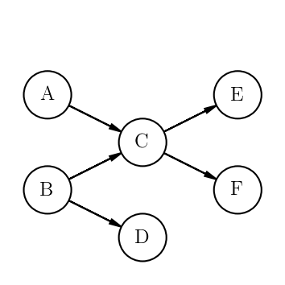

.. _introduction:

What is ProjectPredict?
=======================
ProjectPredict is a library to help project managers gain insight into the status of their project using Bayesian
networks. It is inspired by the paper `"Project scheduling: Improved approach to incorporate uncertainty using Bayesian
networks" <https://www.pmi.org/learning/library/project-scheduling-approach-incorporate-uncertainty-2371>`_
(Khodakarami, Fenton, & Neil, Project Management Journal, 2007). The project features

* Inferring the latest start date, earliest finish date, and total float for each task in a project
* Recommending which task or tasks should be started next using custom constraints and objective functions
* Task duration specified either through `three-point (PERT) estimation
  <https://en.wikipedia.org/wiki/Three-point_estimation>`_ or inferring the duration of a task from a machine
  learning model
* Visualization of a project timeline using `Matplotlib <https://matplotlib.org>`_

The Bayesian network
--------------------
A project is specified as a directed acyclic graph of tasks. For example, suppose you have three tasks, A, B, C, D, E,
and F. Task C can only be begun when tasks A and B are completed, task D can only be completed when task B is completed,
and tasks D and E can only be begun when task B is completed. The resulting graph would look like this:

Each task is then decomposed into a smaller Bayesian network.

Where :math:`D` is the duration, :math:`ES` is the earliest start date, :math:`LS` is the latest start date,
:math:`EF` is the earliest finish date, and :math:`LF` is the deadline or latest finish date. The earliest finish date can
be inferred from the graph by traversing the graph in topological order from the starting tasks (A and B in our
example), from the equations

:math:`ES_i = \max \{ES_j + D_j \; \forall \; \text{predecessor tasks}\; j\}`

:math:`EF_i = ES_i + D_i`

The latest start date for each task can be inferred by traversing teh graph in reverse topological order from the
final tasks (D and E in our example), from teh equations

:math:`LF_i = \max \{LF_j - D_j \; \forall \; \text{successor tasks}\; j\}`

:math:`LS_i = LF_i - D_i`

For our sample project, tasks A and B must be given an earliest start date, and tasks C and D must be given a latest
finish date. Both of these can take the form of either a probability distribution or a hard date. All tasks must
be given a duration, either using three-point estimation or predicted from a learning model.

Once these values have been inferred for each task, the total float can be defined as :math:`TF_i = LF_i - EF_i`. This
is a measure of the amount of time a task's duration can be increased without affecting the completion time of the
project as a whole. The smaller the total float of a task, the more critical the task is to the overall project.