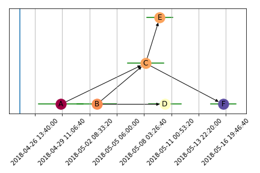

.. _visualization:

Visualization
=============
Currently only one artist, the MatplotlibArtist, is provided by ProjectPredict. It provides a single visualization of a
project based on its generated statistics using matplotlib. It places positions the tasks on a graph based on its
mean latest start date, creating a timeline of the project. Additionally, it can shade the tasks based on either the
total float, latest start, or earliest finish (the default colormap is `Matplotlib's Spectral
<https://matplotlib.org/tutorials/colors/colormaps.html>`_ colormap).

.. note::
   The following example uses the Project developed using the learning model from :ref:`Learned Model`

.. code-block:: python
   :linenos:

   from projectpredict.artists import MatplotlibArtist
   import matplotlib.pyplot as plt

   artist = MatplotlibArtist(project)
   current_time = datetime(year=2018, month=4, day=25)
   fig, ax = artist.draw(current_time=current_time)
   plt.tight_layout()
   plt.savefig('myproject.png')

This results in the following plot:

The horizontal bars indicate the standard deviation of the latest start date, and teh blue vertical bar represents the
current date. These can be toggled off by setting the "show_variance=False" and "show_current_time=False" keyword
arguments respectively.

Custom Visualizations
---------------------
No interface must be satisfied to make your own visualizations, but an ArtistBase class has been provided which supplies
a function, _get_positions(), which generates a timeline-like graph of the project based on the latest start date for
each task in the project. You can choose to extend from this base class or not.

Layout Algorithm
----------------
Constructing the visual layout of the Project is non trivial, and the current implementation still doesn't get it quite
right. Currently the algorithm iterates through the tasks in topological order,

.. code-block:: shell

   find the optimal spacing for the tasks
   initialize the position of the first task (in topological order) to be 0,0
   for task in topological sort of project:
      x_position = task's latest start date
      relevant_positions = all previously-seen tasks such that their x-distance is <= the optimal distance
      if any of relevant_positions are predecessors of the current task:
         relevant_positions = the predecessors of the task which are in relevant_positions
      best_neighbor = the task in relevant_positions whose x-position difference from the current task is greatest
      y_position = y such that (x-position, y) is on a circle centered at best_neighbor with radius optimal_distance
      store x_position, y_position for the task

The optimal distance is rather arbitrarily found by

.. code-block:: shell

   start_tasks = all tasks with no predecessors
   terminal_tasks = all tasks with no successors
   max_path = longest path between any start task and any terminal task
   max_time_difference = (end of max_path's latest finish date - start of max path's latest finish date)
   optimal_distance = max_time_difference / length of max_path